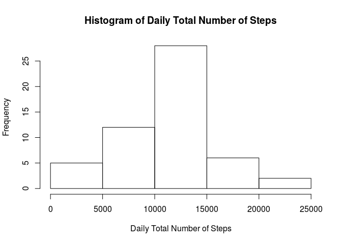
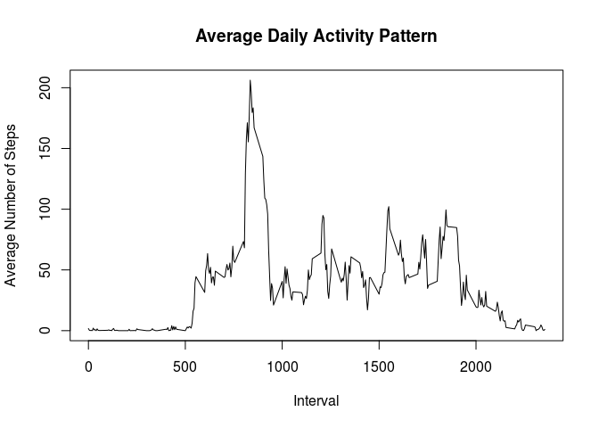
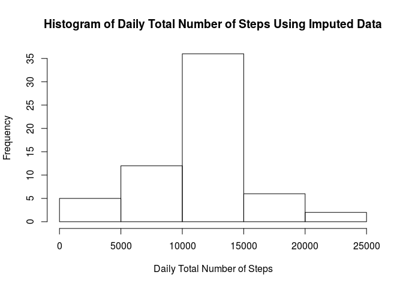
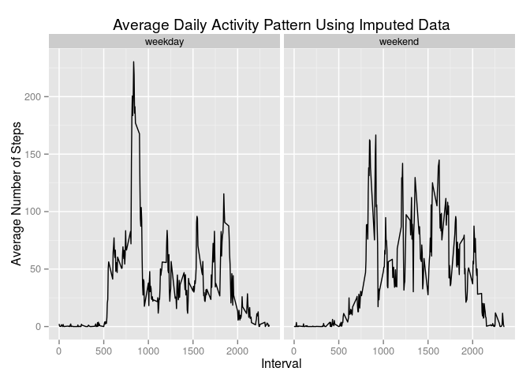

# Reproducible Research: Peer Assessment 1


## Loading and preprocessing the data


```r
unzip("activity.zip")
activitydata <- read.csv("activity.csv")
activitydata$date <- as.Date(activitydata$date, format = "%Y-%m-%d")
```


## What is mean total number of steps taken per day?

1. Make a histogram of the total number of steps taken each day


```r
library(dplyr)
```

```
## 
## Attaching package: 'dplyr'
```

```
## The following objects are masked from 'package:stats':
## 
##     filter, lag
```

```
## The following objects are masked from 'package:base':
## 
##     intersect, setdiff, setequal, union
```

```r
# generate data for total number of steps for each date
totalstepsdata <- select(activitydata, date, steps) %>%
    group_by(date) %>%
    summarise(sum(steps)) %>%
    rename(total_steps = `sum(steps)`)

# plot histogram of total number of steps vs. date
hist(totalstepsdata$total_steps, main = "Histogram of Daily Total Number of Steps", 
     xlab = "Daily Total Number of Steps")
```



2. Calculate and report the mean and median total number of steps taken per day

```r
mean(totalstepsdata$total_steps, na.rm = TRUE)
```

```
## [1] 10766.19
```

```r
median(totalstepsdata$total_steps, na.rm = TRUE)
```

```
## [1] 10765
```


## What is the average daily activity pattern?

1. Make a time series plot (i.e. type = "l") of the 5-minute interval (x-axis) and the average number of steps taken, averaged across all days (y-axis)


```r
# generate data for average daily activity pattern
avgstepsdata <- select(activitydata, steps, interval) %>%
    group_by(interval) %>%
    summarise(mean(steps, na.rm = TRUE)) %>%
    rename(avg_steps = `mean(steps, na.rm = TRUE)`)

# generate average daily activity pattern plot
plot(avgstepsdata$interval, avgstepsdata$avg_steps, 
     type = "l", main = "Average Daily Activity Pattern", xlab = "Interval", 
     ylab = "Average Number of Steps")
```



2. Which 5-minute interval, on average across all the days in the dataset, contains the maximum number of steps?


```r
filter(avgstepsdata, avg_steps == max(avgstepsdata$avg_steps))
```

```
## Source: local data frame [1 x 2]
## 
##   interval avg_steps
##      (int)     (dbl)
## 1      835  206.1698
```


## Imputing missing values

1. Calculate and report the total number of missing values in the dataset (i.e. the total number of rows with NAs)


```r
nrow(activitydata[!complete.cases(activitydata), ])
```

```
## [1] 2304
```

2. Devise a strategy for filling in all of the missing values in the dataset, and create a new dataset that is equal to the original dataset but with the missing data filled in. 

*I created the new dataset by copying the original dataset and replacing the missing values with the mean for that 5-minute interval.*


```r
activitydata2 <- select(activitydata, steps, date, interval)
activitydata2[!complete.cases(activitydata2), c("interval", "steps")] <- avgstepsdata[, c("interval", "avg_steps")]
```

3. Make a histogram of the total number of steps taken each day.


```r
# generate total number of steps for each date using imputed data set
totalstepsdata2 <- select(activitydata2, date, steps) %>%
    group_by(date) %>%
    summarise(sum(steps)) %>%
    rename(total_steps = `sum(steps)`)

# plot histogram of total number of steps vs. date
hist(totalstepsdata2$total_steps, main = "Histogram of Daily Total Number of Steps Using Imputed Data", xlab = "Daily Total Number of Steps")
```



4. Calculate and report the mean and median total number of steps taken per day. Do these values differ from the estimates from the first part of the assignment? What is the impact of imputing missing data on the estimates of the total daily number of steps?


```r
mean(totalstepsdata2$total_steps)
```

```
## [1] 10766.19
```

```r
median(totalstepsdata2$total_steps)
```

```
## [1] 10766.19
```

*There is no difference in the mean values between the original and new datasets. However, the mean and median values are the same for the new dataset.*


## Are there differences in activity patterns between weekdays and weekends?

1. Create a new factor variable in the dataset with two levels -- "weekday" and "weekend" indicating whether a given date is a weekday or weekend day.


```r
# adding a day_type variable to the new data set
activitydata2 <- mutate(activitydata2, day_type = weekdays(date)) 
for (row in 1:nrow(activitydata2)) {
    if (activitydata2$day_type[row] == "Saturday" | activitydata2$day_type[row] == "Sunday") {
        activitydata2$day_type[row] <- "weekend"
    }
    else {
        activitydata2$day_type[row] <- "weekday"
    }
}
activitydata2 <- transform(activitydata2, day_type = factor(day_type))
```

2. Make a panel plot containing a time series plot (i.e. type = "l") of the 5-minute interval (x-axis) and the average number of steps taken, averaged across all weekday days or weekend days (y-axis).


```r
library(ggplot2)

# generate average daily activity pattern data using imputed data set
avgstepsdata2 <- select(activitydata2, steps, interval, day_type) %>%
    group_by(interval, day_type) %>%
    summarise(mean(steps, na.rm = TRUE)) %>%
    rename(avg_steps = `mean(steps, na.rm = TRUE)`)

# generate average daily activity pattern plot
plot2 <- ggplot(avgstepsdata2, aes(interval, avg_steps))
plot2 +
    geom_line() +
    facet_grid(. ~ day_type) +
    labs(x = "Interval") +
    labs(y = "Average Number of Steps") +
    labs(title = "Average Daily Activity Pattern Using Imputed Data")
```



*The overall pattern between the two plots are similar (i.e. number of steps in intervals 0-500 are close to zero), with larger fluctuations in weekend activity in the 750-2000 interval range. During the weekdays, there is higher activity in the earlier part of the day, while the weekend activity is more evenly distributed most of the day.*
